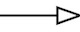
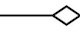
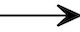

## Object Oriented Design
### <a href='https://web.microsoftstream.com/group/47ff5be4-af38-493f-a1c8-650acc485651?view=videos' target='_blank'> Weekly Briefing  </a>
### Task 1: Introduction
 <a href='01%20Introduction/slides/segment-1.pdf' target='_blank'>  </a> <a href='01%20Introduction/video/segment-1.mp4' target='_blank'>  </a>

This week's workbook focuses on devising and documenting the design of complex software systems. The design process is very much a creative activity that takes us from an identified "problem" all the way through to an abstract representation of a technical solution to that problem. The solution is presented as a set of design documents (a bit like a "blueprint") that describes the structure and abstract behaviour of the intended system.

It is worth noting at this point that the design process is not formulaic - there is no universal mechanism that can be used to "derive" a system design. There are analysis tool and techniques that can assist, but the process relies heavily on the skill and experience of the human designers. View the slides and video above to find out more about the nature of design and the importance of undertaking it _before_ implementation begins. Once you have gained this understanding, move on to the subsequent tasks in this workbook.

  


# 
### Task 2: Documenting Design
 <a href='02%20Documenting%20Design/slides/segment-1.pdf' target='_blank'>  </a> <a href='02%20Documenting%20Design/video/segment-1.mp4' target='_blank'>  </a>

As we shall soon see, there are many different aspects to a system's design. In order to document this design, we are going to need a mechanism to express all of these aspects in an assessable and easy-to-understand manner. A key part of this is the use of a standard set of diagrams and notations that, once trained to interpret such diagrams, any developer will be able to understand and work with. View the sides and video linked to above to find out about one such standard - The Unified Modelling Language (UML). UML is _very_ comprehensive and extensive - we will however only be using a small proportion of it in this unit. It is worth noting that other standards exist, however UML is popular and as such is the clear choice for study on this unit.  


# 
### Task 3: Diagramming Tools


As you will have seen from viewing the slides in the previous section, there are a lot of diagrams and notations within the Unified Modelling Language. When creating design documents for a software system, we _could_ use a general purpose graphical editor (such as Photoshop) to create UML diagrams. This would however require us as designers to recall and apply all of the correct graphical notations. For this reason, it is more common for developers to use a purpose-built UML editor (or UML plugin to a general purpose editor).

<a href="https://products.office.com/en/visio/" target="_blank">Microsoft Visio</a> is one commercially available tool that supports the UML standard notation. <a href="https://www.umlet.com/" target="_blank">Umlet</a> on the other hand is a popular open-source alternative for developers on a tight budget. There are also numerous plugins for different IDEs (such as Eclipse, IntelliJ etc.). In this workbook we will however be making use of an open source graphical platform called <a href="https://graphviz.org/" target="_blank">Graphviz</a>. The benefit of Graphviz is that diagrams are specified textually (using a specialised markup language). We need only describe the logical structure of the diagram, Graphviz then handles all graphical layout and positioning for us (a big benefit for design diagrams which are frequently evolving).

Various Graphvis tools are available to install, we will however make use of an <a href="https://dreampuf.github.io/GraphvizOnline/" target="_blank">online rendering tool</a> (which avoids the need for us to install any software). You might like to take a quick look at this tool now, just to familiarise yourself with some of its features. When you first load the page you will see a sample diagram which will help illustrate how Graphviz operates. We will be using this tool to create UML diagrams later in this workbook - however, we first need to do a bit of analysis...  


# 
### Task 4: Noun-Verb Analysis
 <a href='04%20Noun-Verb%20Analysis/slides/segment-1.pdf' target='_blank'>  </a> <a href='04%20Noun-Verb%20Analysis/video/segment-1.mp4' target='_blank'>  </a>

As we mentioned previously, there is no formulaic or mechanistic way to go from an identified problem to the design for a solution. HOWEVER, all is not lost - there are a number of approaches that will at least help you get started on the way towards a solution. One such approach is known as "Noun-Verb" analysis. View the slides and video linked to above to gain an understanding of this approach. Once you have done so, your job is to identify a set of classes and a set of methods for our example system (IMDB).

As a target for your analysis, take a look at the "overview" and "features" sections of the <a href="https://en.wikipedia.org/wiki/IMDb" target="_blank">IMDB wikipedia page</a>. As you work your way through the wikipedia page, make a note of all classes and methods you identify - you will not need to submit them via the weekly workbook form just yet (we will be refining them further before the end of this workbook).

  


# 
### Task 5: Rationalisation
 <a href='05%20Rationalisation/slides/segment-1.pdf' target='_blank'>  </a> <a href='05%20Rationalisation/video/segment-1.mp4' target='_blank'>  </a>

Noun-verb analysis provides a good "first attempt" at identifying classes and methods for an Object Oriented Design. _However_, if often results in duplicates as well as "inappropriately" sized classes (either too small and simple or too large and complex). As a result of this, we must typically bring our judgement into play as experienced developers in order to adjust the output of noun-verb analysis into something that can form the basis of a solid design.

View the slides and video linked to above to gain an understanding of the type and range of design decisions we might have to make. With this in mind, rationalise the output of your previous noun-verb analysis into a set appropriate classes, attributes and methods. Again, there is no need to submit these via the weekly workbook forms - we will further process these in subsequent tasks later on in this workbook.

  


# 
### Task 6: Class Diagram
 <a href='06%20Class%20Diagram/slides/segment-1.pdf' target='_blank'>  </a> <a href='06%20Class%20Diagram/video/segment-1.mp4' target='_blank'>  </a>

Now that you have arrived at a suitable set of classes, attributes and methods, our next task is to present these is an appropriate manner. In order to do this, we will use one of the standard diagrams from the Unified Modeling Language - the Class Diagram. You will already have some experience of _interpreting_ class diagrams from the Java unit, however now you will get the opportunity to actually create one of these diagrams of your own.

Create a class diagram for the IMDB system by writing a Graphvis document that defines the structure of your diagram. To help get you started, we have provided you with a simple example Graphvis document (written in a language called `dot`) as shown below:

``` java
digraph diagram {
	node [shape="record", fontname="helvetica", fontsize=11]
	rankdir = BT

	Robot [label="{
		Robot
		|
		- name : String \l
		- powerLevel : float \l
		|
		+ talk(String) : void \l
		+ charge(float) : void \l
	}"]
}
```
The first three lines create a new diagram, define the appearance of a "node" (in this case the classes in the diagram) and set the layout of the diagram to be vertical (`BT` means "Bottom to Top"). Most of the remaining lines of the document create a new class (called `Robot`) which contains two attributes (`name` and `powerLevel`) and two methods (`talk` and `charge`). Two `dot` formatting notations that you should be aware of are newlines (represented as `\l`) and horizontal section dividers (represented somewhat counter-intuitively as `|`).

You should also note that in UML, return types are shown _after_ the attribute/method name (following the `:` character), parameters are presented as type only (i.e. no parameter name) and the method visibility is presented using a single character at the start of each line (`+` is public, `-` is private, `#` is protected).

The Graphvis document above will generate the class shown in the diagram below when processed by a Graphviz rendering tool such as the
<a href="https://dreampuf.github.io/GraphvizOnline/" target="_blank">online tool</a> recommended previously.   


**Hints & Tips:**  
You may have identified a large number of classes, attributes and methods during your previous analysis activities. To reduce the amount of work you will need to spend on this current task, your class diagram should only include 5 or 6 of the **most important** classes and 3 or 4 of the **most essential** methods and attributes of each class. Remember that design documentation is supposed to be abstract and high level - it is _not_ intended to represent every single detail of a system. A key skill of good designer is deciding what to include and what can safely be omitted.
  


# 
### Task 7: Relationships
 <a href='07%20Relationships/slides/segment-1.pdf' target='_blank'>  </a> <a href='07%20Relationships/video/segment-1.mp4' target='_blank'>  </a>

Class diagrams are not just about classes, attributes and methods - a key part of them are the various relationships that exist _between_ classes. View the slides and video linked to above for a discussion of the various relationships that can exist. Then, with this knowledge in mind, add some relationships to your class diagram. To help you in this task, the following Graphviz document illustrates the addition of a relationship link between the `TranslationRobot` class and the `Robot` class through the use of the `->` symbol. Note that we have simplified the two classes (by removing all attributes and methods) for the sake of simplicity and readability.

``` java
digraph diagram {
	node [shape="record", fontname="helvetica", fontsize=11]
	rankdir = BT

	Robot [label="{Robot}"]
	TranslationRobot [label="{TranslationRobot}"]

	TranslationRobot -> Robot [arrowhead="empty"]
}
```
Graphviz supports various different UML relationships notions including:

- Inheritance: rendered using `arrowhead = "empty"` and looks like this: 
- Aggregation: rendered using `arrowhead = "odiamond"` and looks like this: 
- Dependency: rendered using `arrowhead = "vee"` and looks like this: 

You might like to try to include examples of all of the above relationship types in your class diagram. Once you have completed your diagram, generate a PNG image of it (by setting "Format" to `png-image-element` and then clicking the "Download" button). Finally upload your class diagram via the <a href="https://forms.office.com/Pages/ResponsePage.aspx?id=MH_ksn3NTkql2rGM8aQVG37h-tXTP5NGqEknVplKlalUQUIwVlVRMzVLMFJRSjRMTFNBWkpLVFcwRy4u" target="_blank">online submission form</a>.  


# 
### Task 8: Sequence Diagram
 <a href='08%20Sequence%20Diagram/slides/segment-1.pdf' target='_blank'>  </a> <a href='08%20Sequence%20Diagram/video/segment-1.mp4' target='_blank'>  </a>

Sequence Diagrams represent another key model from the UML standard set. View the slides and video linked to above for a discussion of the purpose of sequence diagrams and to see an example of this type of diagram in action. Ensure that you understand the purpose and nature of sequence diagrams. You are however not required to create such a diagram for the IMDB example system - we have done enough work already this week ! Do bear in mind that you may be asked to create such a diagram to document your future projects - so make sure you have a clear understand of them at this stage.  


# 
